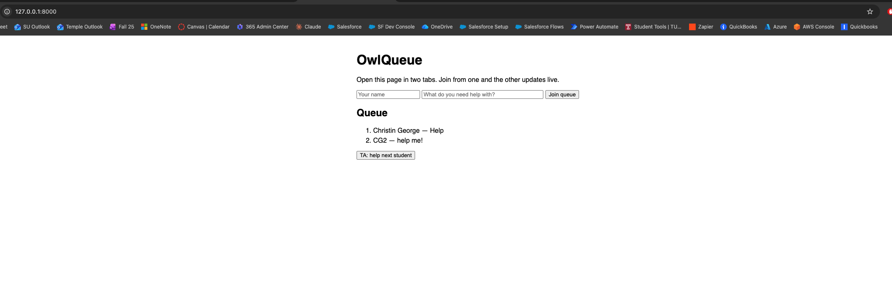
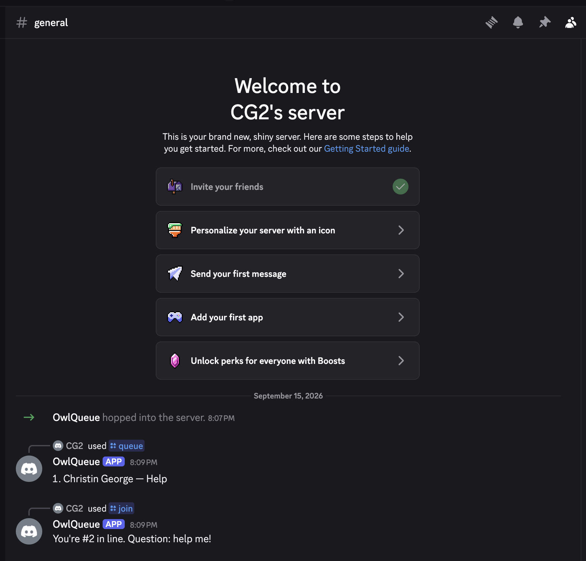

# OwlQueue

OwlQueue is an office hours queue for Temple University courses. Students join a
queue from a web page or from Discord, TAs call the next student, and everyone
sees the queue update in real time. This repository is the proof of concept for
my CIS 3296 project proposal: it shows Django, Django Channels (WebSockets),
SQLite, and discord.py working together. Google Workspace sign-in and Canvas
roster import are planned for the full project and are not part of this PoC.




Built and tested on macOS Sequoia 15.1 (Apple Silicon).

## How to run

1. Clone the repository and create a virtual environment:

   git clone https://github.com/tun43377/OwlQueue.git
   cd OwlQueue
   python3 -m venv .venv
   source .venv/bin/activate
   pip install -r requirements.txt

2. Create the database:

   python3 manage.py migrate

3. Start the web server:

   python3 manage.py runserver

   Open http://127.0.0.1:8000 in two browser tabs. Join the queue in one tab
   and the other updates instantly. Click "TA: help next student" to remove the
   first entry.

   ## Running the Discord bot (optional)

1. Create a bot at https://discord.com/developers/applications, enable the
   Message Content intent, and invite it to a server with the `bot` and
   `applications.commands` scopes.
2. In a second terminal:
```
   source .venv/bin/activate
   export DISCORD_TOKEN=your-bot-token
   python3 manage.py runbot
```
3. In Discord, use `/join question:<text>` to join the queue and `/queue` to
   see it. Entries made in Discord appear on the web page because both use the
   same database.

## Project structure

- `owlqueue/` — Django project settings, URL config, and ASGI entry point
- `ohq/models.py` — `QueueEntry` model
- `ohq/consumers.py` — WebSocket consumer that handles join/next and broadcasts the queue
- `ohq/templates/ohq/index.html` — single-page web client
- `ohq/management/commands/runbot.py` — Discord bot (`python3 manage.py runbot`)

## Sources

- Django Channels tutorial (Parts 1–2): https://channels.readthedocs.io/en/latest/tutorial/
- discord.py quickstart: https://discordpy.readthedocs.io/en/stable/quickstart.html